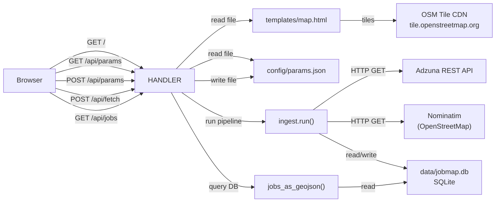
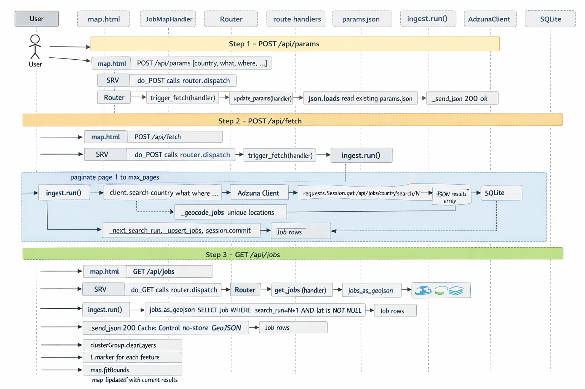
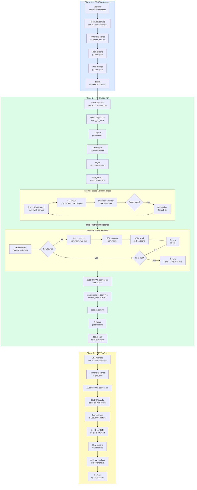
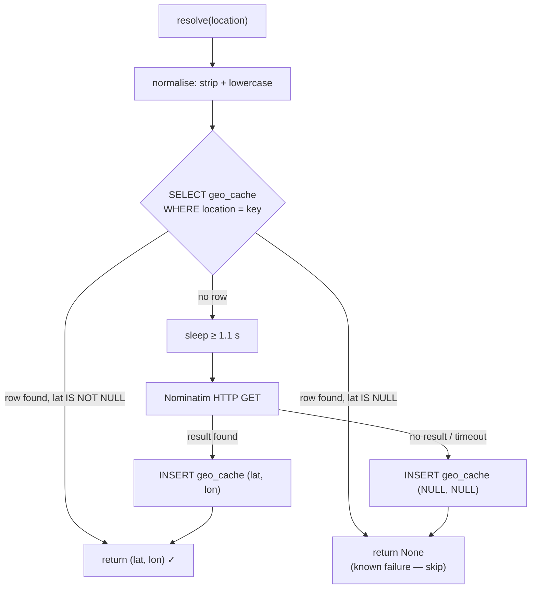
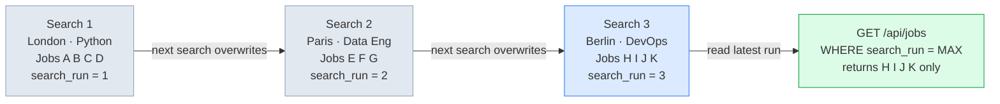
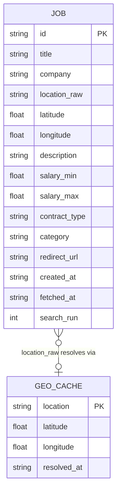
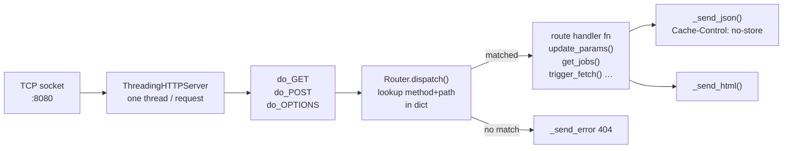

# JobMap — Architecture & Flow Reference

---

## 1. Module Import Graph — all dependencies

Three tiers: project modules, third-party packages, stdlib groups.
Dashed edge = lazy import inside a function body.

```mermaid
graph TD

    subgraph SCRIPTS["scripts/"]
        SERVE["serve.py"]
        FETCH["fetch_jobs.py"]
    end

    subgraph SRV["src/server/"]
        HANDLER["handler.py"]
        ROUTER["router.py"]
    end

    subgraph PIPE["src/pipeline/"]
        INGEST["ingest.py"]
    end

    subgraph EXP["src/export/"]
        GEOJSON["geojson.py"]
    end

    subgraph API["src/api/"]
        ADZUNA["adzuna.py"]
    end

    subgraph GEO["src/geo/"]
        GEOCODER["geocoder.py"]
    end

    subgraph DB["src/db/"]
        MODELS["models.py"]
        SESSION["session.py"]
    end

    subgraph CFG["config/"]
        SETTINGS["settings.py"]
    end

    subgraph TP["Third-party"]
        REQUESTS["requests + urllib3"]
        GEOPY["geopy"]
        SQLALCHEMY["sqlalchemy"]
        DOTENV["python-dotenv"]
    end

    subgraph SL["stdlib"]
        SL_NET["http.server"]
        SL_THR["threading"]
        SL_DT["datetime"]
        SL_IO["pathlib + os"]
        SL_JSON["json"]
        SL_CLI["argparse + sys"]
        SL_TIME["time"]
        SL_LOG["logging + typing + dataclasses"]
    end

    %% ── scripts ──────────────────────────────────────────────
    SERVE --> SETTINGS
    SERVE --> SESSION
    SERVE --> HANDLER
    SERVE --> SL_NET
    SERVE --> SL_CLI
    SERVE --> SL_IO
    SERVE --> SL_LOG

    FETCH --> SETTINGS
    FETCH --> INGEST
    FETCH --> SL_CLI
    FETCH --> SL_JSON
    FETCH --> SL_IO
    FETCH --> SL_LOG

    %% ── server ────────────────────────────────────────────────
    HANDLER --> SETTINGS
    HANDLER --> GEOJSON
    HANDLER --> ROUTER
    HANDLER -.->|lazy in trigger_fetch| INGEST
    HANDLER --> SL_NET
    HANDLER --> SL_THR
    HANDLER --> SL_JSON
    HANDLER --> SL_IO
    HANDLER --> SL_LOG

    ROUTER --> SL_LOG

    %% ── pipeline ──────────────────────────────────────────────
    INGEST --> SETTINGS
    INGEST --> ADZUNA
    INGEST --> MODELS
    INGEST --> SESSION
    INGEST --> GEOCODER
    INGEST --> SQLALCHEMY
    INGEST --> SL_JSON
    INGEST --> SL_IO
    INGEST --> SL_LOG

    %% ── export ────────────────────────────────────────────────
    GEOJSON --> MODELS
    GEOJSON --> SESSION
    GEOJSON --> SQLALCHEMY
    GEOJSON --> SL_LOG

    %% ── api ───────────────────────────────────────────────────
    ADZUNA --> SETTINGS
    ADZUNA --> REQUESTS
    ADZUNA --> SL_LOG

    %% ── geo ───────────────────────────────────────────────────
    GEOCODER --> SETTINGS
    GEOCODER --> MODELS
    GEOCODER --> SESSION
    GEOCODER --> GEOPY
    GEOCODER --> SL_TIME
    GEOCODER --> SL_LOG

    %% ── db ────────────────────────────────────────────────────
    SESSION --> SETTINGS
    SESSION --> MODELS
    SESSION --> SQLALCHEMY
    SESSION --> SL_LOG

    MODELS --> SQLALCHEMY
    MODELS --> SL_DT
    MODELS --> SL_LOG

    %% ── config ────────────────────────────────────────────────
    SETTINGS --> DOTENV
    SETTINGS --> SL_IO
    SETTINGS --> SL_LOG

    %% ── colour coding ─────────────────────────────────────────
    classDef project  fill:#dbeafe,stroke:#3b82f6,color:#1e3a5f
    classDef thirdpty fill:#fef9c3,stroke:#ca8a04,color:#713f12
    classDef stdlib   fill:#f1f5f9,stroke:#94a3b8,color:#334155

    class SERVE,FETCH,HANDLER,ROUTER,INGEST,GEOJSON,ADZUNA,GEOCODER,MODELS,SESSION,SETTINGS project
    class REQUESTS,GEOPY,SQLALCHEMY,DOTENV thirdpty
    class SL_NET,SL_THR,SL_DT,SL_IO,SL_JSON,SL_CLI,SL_TIME,SL_LOG stdlib
```



---

## 2. Request / Response Map (all HTTP routes)



---

## 3. Search and Fetch Timeline (single button press)

Three sequential phases triggered by a single button press.




---

## 4. Geocoding Cache Logic



---

## 5. search_run Isolation Mechanism



---

## 6. Persistence Layer Schema



---

## 7. Server Dispatch Chain



---

## 8. File Layout vs Responsibility

```
jobmap/
│
├── .env                     ← secrets (never committed)
├── .env.example             ← template
├── requirements.txt
│
├── config/
│   ├── settings.py          ← single typed facade over os.environ
│   └── params.json          ← mutable search state (R/W at runtime)
│
├── src/
│   ├── api/
│   │   └── adzuna.py        ← HTTP adapter: Adzuna → [RawJob]
│   │                           retry, pagination, deserialisation
│   ├── geo/
│   │   └── geocoder.py      ← location string → (lat, lon)
│   │                           Nominatim + SQLite cache
│   ├── db/
│   │   ├── models.py        ← ORM: Job, GeoCache
│   │   └── session.py       ← engine, SessionFactory, init_db + migrations
│   ├── pipeline/
│   │   └── ingest.py        ← orchestrator: params → fetch → geocode → persist
│   ├── export/
│   │   └── geojson.py       ← DB → RFC 7946 GeoJSON (latest run only)
│   └── server/
│       ├── router.py        ← decorator route registry
│       └── handler.py       ← BaseHTTPRequestHandler + all route bodies
│
├── templates/
│   └── map.html             ← self-contained SPA
│                               Leaflet + MarkerCluster + search widgets
│                               pure fetch() API calls, no framework
│
└── scripts/
    ├── serve.py             ← CLI: ThreadingHTTPServer entry point
    ├── fetch_jobs.py        ← CLI: headless pipeline (no server needed)
    └── debug_params.py      ← diagnostic: POST→GET round-trip diff
```
